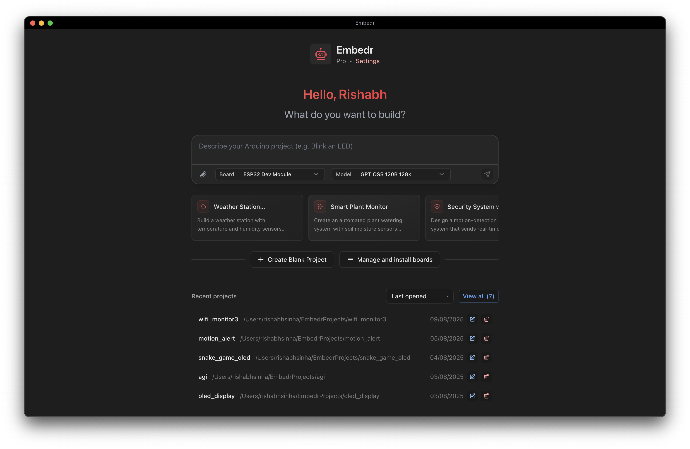

## Embedr
### Agentic IDE for hardware developers

Embedr is a modern, AI‑powered desktop IDE for Arduino and embedded development. It combines a beautiful editor with an agentic copilot that can generate sketches from plain English, analyze build errors, manage libraries, and help you compile and flash to boards in one click. This repository is dedicated to hosting installer builds and release artifacts.

### Download
- Get the latest installers from this repository's Releases page

### Learn more
- Visit the official website: https://embedr.cc