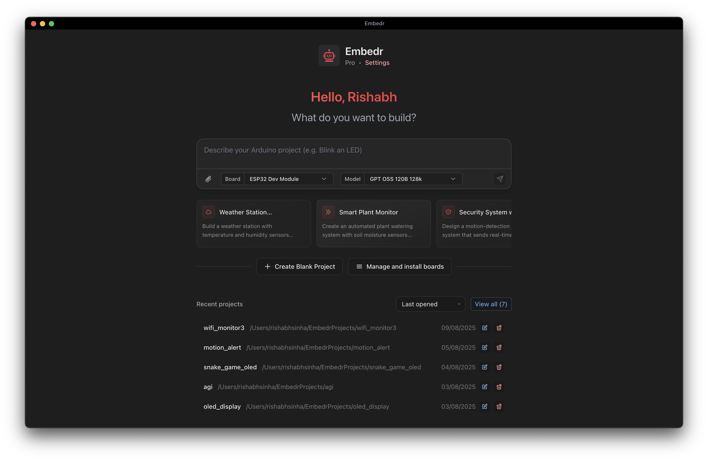

## Embedr
### Agentic IDE for hardware developers

Embedr is a modern, AI‑powered desktop IDE for Arduino and embedded development. It combines a beautiful editor with an agentic copilot that can generate sketches from plain English, analyze build errors, manage libraries, and help you compile and flash to boards in one click. This repository is dedicated to hosting installer builds and release artifacts.

### Install

macOS and Linux:

```bash
curl -fsSL https://get.embedr.app | bash
```

Windows:

```powershell
irm https://get.embedr.app/install.ps1 | iex
```

Specific version:

```bash
curl -fsSL https://get.embedr.app/install.sh | bash -s -- --version v0.2.1
```

### Hosting

This repository is configured for Cloudflare Pages. The build copies the root installer scripts into `dist/`, so:

- `https://get.embedr.app/` redirects to `https://get.embedr.app/install.sh`
- `https://get.embedr.app/install.sh` serves the macOS/Linux installer
- `https://get.embedr.app/install.ps1` serves the Windows installer

Cloudflare Pages settings:

- Build command: `bash scripts/build-pages.sh`
- Build output directory: `dist`
- Custom domain: `get.embedr.app`

### Download
- Get the latest installers from this repository's Releases page

### Learn more
- Visit the official website: https://embedr.app
